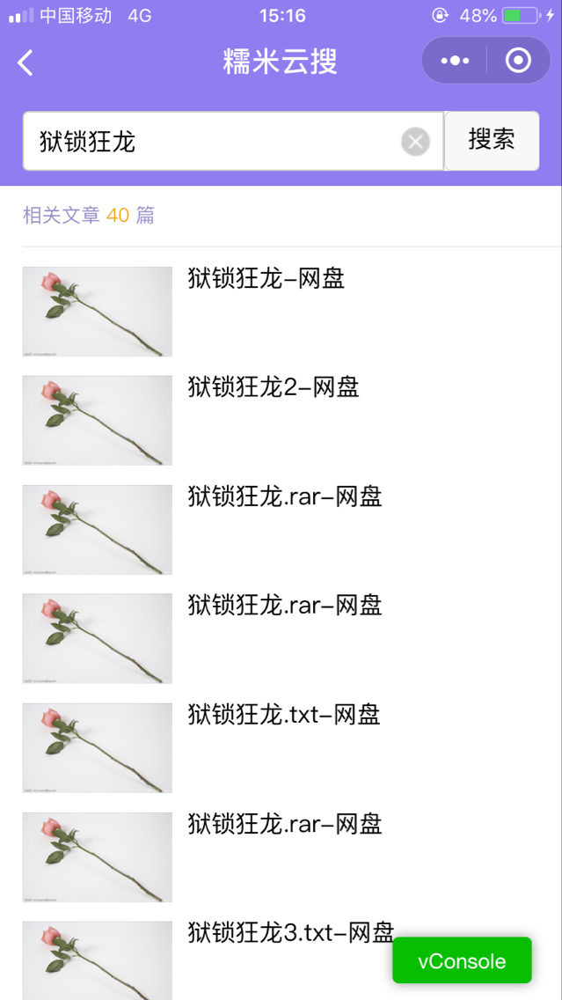

# 微信小程序－网盘搜索

### 说明：

实现网盘搜索功能，特色：
- 使用fontawesome字体

### 目录结构：

- icons — 存放项目图片文件
- pages — 存放项目页面文件
- utils — 存放格式化文件
- fonts — 存放字体文件

### 开发环境：

微信web开发者工具 v0.11.122100

### 项目截图：

## Screen Shots

* 首页
 
* 搜索页

* 内容页

